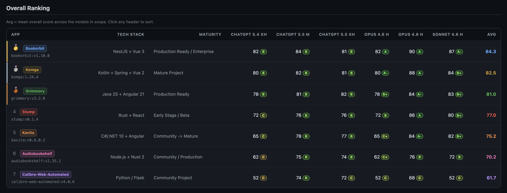

# Book Manager Benchmarks

A benchmark suite covering two distinct lenses for comparing popular self-hosted book management apps: **ingestion performance** and **engineering code quality**.

## Contents

| Benchmark | What it measures | Dashboard |
|---|---|---|
| [Performance](#performance-load-test-benchmarks) | Ingestion speed, RAM, CPU across 10K-150K books | [Interactive Dashboard](https://htmlpreview.github.io/?https://github.com/kevin-s722/book-apps-benchmark/blob/main/reference/comparison.html) |
| [Engineering Scorecard](#engineering-scorecard) | Code quality across 10 engineering categories, scored by 6 AI model configurations | [Interactive Dashboard](https://htmlpreview.github.io/?https://github.com/kevin-s722/book-apps-benchmark/blob/main/engineering-scorecard/comparison.html) |

---

## Performance - Load Test Benchmarks

A self-contained benchmark suite for comparing library ingestion performance across popular self-hosted book management apps.

**Who this is for:** If you have a small library (a few hundred to a few thousand books), all tested apps will handle it fine and this benchmark will not matter much to you. These tests are aimed at book hoarders - people with 10K, 50K, 100K+ titles where scan times are measured in minutes to hours and memory headroom is a real constraint.

**Hardware used:** Apple M4 Mac Mini, 16 GB RAM, 8 GB RAM and 6 CPUs assigned to Docker Desktop

## Results

**Interactive Comparison Dashboard**
Dive into the full data yourself using the [Interactive Benchmark Dashboard](https://htmlpreview.github.io/?https://github.com/kevin-s722/book-apps-benchmark/blob/main/reference/comparison.html). This pre-built dashboard covers 5 apps tested across up to 4 book counts (10K, 50K, 100K, 150K).

The DB RAM checkbox in the dashboard lets you include or exclude database container memory from the totals. Uncheck it if you plan to use a dedicated external database - the app-only memory will be significantly lower.

## Analysis and Recommendations

All RAM figures include the app container **and** any associated database container
(PostgreSQL for Bookorbit, MariaDB for Grimmory). Kavita, Stump, and Komga run no
external DB - their figures are already total.

## Scope of This Benchmark

This test measures only **ingestion performance and resource usage** - how fast each app scans a library of EPUB files, and how much RAM/CPU it uses while doing so and while idle.

**Who this matters for:** If you have a small library - say under a few thousand books - all of these apps will handle it without breaking a sweat and you likely won't notice the differences measured here. This benchmark is aimed at book hoarders: people with 10K, 50K, 100K+ titles where ingestion time is measured in minutes to hours, idle RAM headroom is a real constraint, and picking the wrong app means waiting an hour for a scan or watching a low-memory device OOM.

It does not cover UI quality, reading experience, mobile apps, OPDS support, shelf/collection management, user management, metadata editing, comic/manga features, Kobo/e-reader sync, plugin ecosystems, community support, or how actively each project is maintained. Those dimensions matter as much or more than ingestion speed for most users, and the rankings here may look completely different if you weigh them.

Use this data to understand resource requirements and initial-scan wait times - not as a final verdict on which app is "best".

---

## Raw Numbers

For the full raw data tables (Ingestion Time, Throughput, Idle RAM, Peak RAM, and CPU Usage), please see [RAW_NUMBERS.md](RAW_NUMBERS.md).

---

## Summary

| App       | Fastest ingestion | Lowest idle RAM (total) | Practical ceiling |
|-----------|-------------------|------------------------|-------------------|
| Bookorbit | Yes (all sizes)   | At 50K and 150K        | 150K+ (scales well) |
| Kavita    | Second (close)    | At 10K-100K            | 150K (RAM grows at 150K) |
| Audiobookshelf | No | At 10K only (125 MB) | ~50K (slows down drastically beyond) |
| Tome      | No                | At 10K only (190 MB)   | ~10K (degrades sharply beyond) |
| Stump     | At 10K only       | No                     | ~20K (degrades beyond) |
| Grimmory  | No                | No                     | Resource-heavy; evaluate on features if hardware allows |
| Komga     | No                | No                     | Mature comic/manga app; evaluate on features if RAM allows |

Bookorbit wins on raw ingestion speed at every size. Kavita wins on RAM efficiency at small-to-mid scale and requires no database sidecar. For most users with libraries under 100K books, Kavita is a strong pick on performance grounds; Bookorbit becomes the clearer choice above 100K or when ingestion speed is the priority. Audiobookshelf and Tome are highly efficient for small libraries (~10K) but their speed and RAM footprint degrade sharply beyond that. Grimmory, Komga, and Calibre-Web-Automated may offer features, UIs, or ecosystem integrations that outweigh their performance numbers for the right user - this benchmark cannot speak to that.

---

## Full Analysis

Detailed per-app observations, recommendations by use case, and hardware requirements are in [ANALYSIS.md](ANALYSIS.md).

---

## Running Your Own Benchmark

Step-by-step instructions, monitor usage, and the comparison dashboard generator are in [RUNNING.md](RUNNING.md).

## Reference results

Pre-run data is in the `reference/` folder - committed to the repo so you can view results immediately without running anything. Each `data.csv` has per-5-second samples of CPU%, RAM (MB), and PID count. Each `report.html` is a standalone per-run chart (note: these load Chart.js from jsDelivr and require internet access to render). `comparison.html` is fully self-contained.

When you run your own tests, new runs land in `results/` (gitignored). Running `generate_comparison.py` builds `results/comparison.html` from your runs. Pass `--reports-dir ../results ../reference` to include the reference data alongside your own. Use `--chartjs-file` to run fully offline.

Test methodology used for the reference runs:

1. All other containers stopped before each run
2. Docker Desktop restarted between app switches to clear memory pressure
3. Library created with all books from the relevant folder, scanned in one shot
4. Monitor started immediately before confirming the library save
5. Books folder mounted read-only - no writes by the app to the book files
6. Where supported: watch-for-new-files was enabled and KoReader metadata hash matching was enabled
7. EPUBs used are synthetic and intentionally minimal (a few KB each). Real-world EPUBs with embedded cover images, fonts, and rich metadata are typically 1-20 MB each. Per-file I/O, metadata extraction, and thumbnail generation take longer on real files - these results represent best-case ingestion speed. Relative rankings between apps are likely to hold, but absolute times will be higher with real libraries.

---

## Engineering Scorecard

A code quality assessment of 7 self-hosted book management apps, independently scored by 6 AI model configurations (3 ChatGPT, 3 Claude) across 10 engineering categories on a 0-100 scale.

**[Interactive Engineering Scorecard Dashboard](https://htmlpreview.github.io/?https://github.com/kevin-s722/book-apps-benchmark/blob/main/engineering-scorecard/comparison.html)**

Each app was assessed from the source code at a specific image tag. Categories scored: Architecture, Security, Maintainability, Modularity, Code Quality, Testing, Documentation, Performance Design, Developer Experience, Long-Term Sustainability.

### Overall Engineering Scores (avg across 6 models)

| Rank | App | Image Tag | Avg Score |
|---|---|---|---|
| 1 | **bookorbit** | `ghcr.io/bookorbit/bookorbit:v1.10.0` | **84.3** |
| 2 | **komga** | `ghcr.io/gotson/komga:1.24.4` | **82.5** |
| 3 | **grimmory** | `ghcr.io/grimmory-tools/grimmory:v3.2.0` | **81.0** |
| 4 | **stump** | `ghcr.io/aaronleopold/stump:v0.1.4` | **77.0** |
| 5 | **kavita** | `ghcr.io/kareadita/kavita:v0.9.0.2` | **75.2** |
| 6 | **audiobookshelf** | `ghcr.io/advplyr/audiobookshelf:v2.35.1` | **70.2** |
| 7 | **calibre-web-automated** | `ghcr.io/crocodilestick/calibre-web-automated:v4.0.6` | **61.7** |

For the full breakdown by category, model, and detailed findings see [engineering-scorecard/summary.md](engineering-scorecard/summary.md) or the [interactive dashboard](https://htmlpreview.github.io/?https://github.com/kevin-s722/book-apps-benchmark/blob/main/engineering-scorecard/comparison.html).

The assessment prompt used is in [engineering-scorecard/prompt.md](engineering-scorecard/prompt.md). Per-app, per-model reports are in the `engineering-scorecard/<app>-<tag>/` subfolders.
